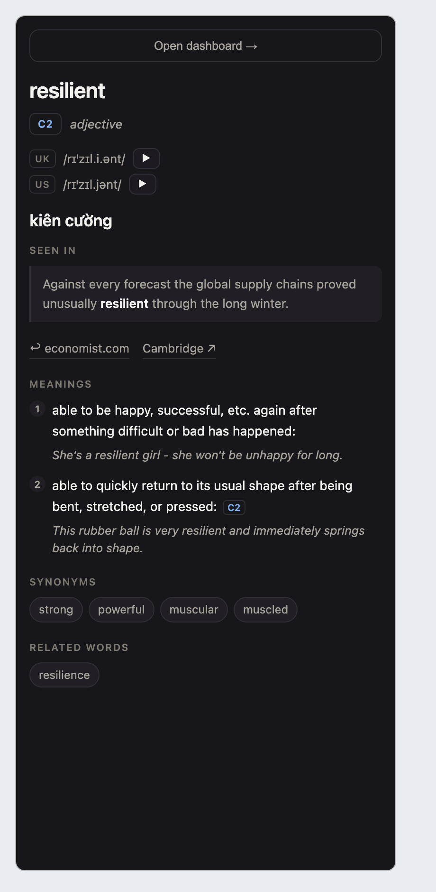
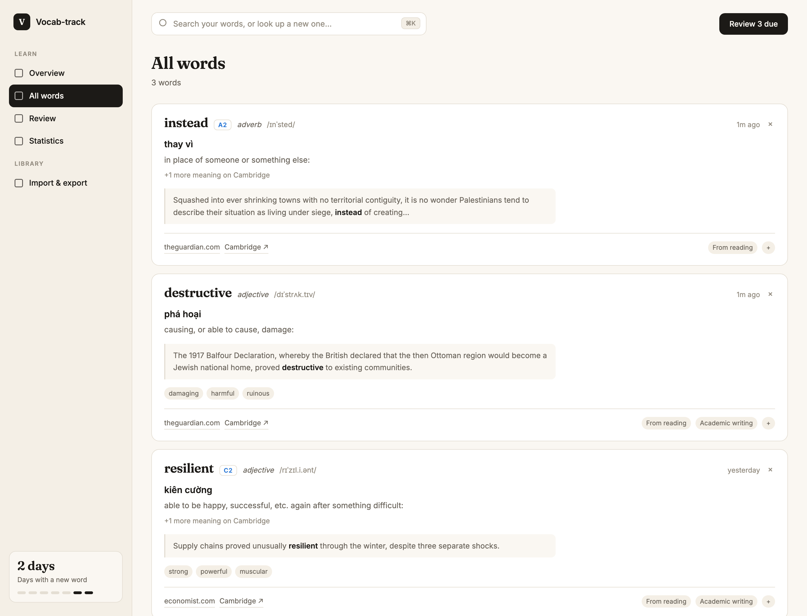

# Vocab-track

A personal Chrome extension for learning vocabulary while reading. English and
Korean.

Select a word on any page, click the button that appears, and the side panel
shows what the dictionary has. For English that is the Cambridge entry — CEFR
level, UK and US pronunciation, every sense with its own level and example,
synonyms — alongside a Vietnamese translation and **the sentence you met it
in**. Saved words are highlighted when you revisit the page, and reviewed as
flashcards on a spaced-repetition schedule.

Korean is newer and much thinner: a Vietnamese gloss, the sentence, the
highlighting and the review schedule, with no dictionary behind it yet. See
*Languages* below, which says plainly what it does and does not do.

Built for one person. No accounts, no sync, no server.

| Side panel | Dashboard |
|---|---|
|  |  |

## What it does

- **Look up while reading.** Select a word, click 📘. No typing, no tab switch.
- **In two languages.** English and Korean, switched in the dashboard's top
  bar. The *lookup* needs no switch — it routes on the script of what you
  selected — so `책을` picked out of a Korean page saves as `책` while you are
  still in an English session, and the toggle catches up. See *Languages*.
- **Look up while watching.** On YouTube, click a word in the subtitles. The
  video pauses, the word is saved with the line it was said in, and the source
  link takes you back to that exact second.
- **Keep the context.** The sentence the word appeared in is saved with it, and
  clicking the source link jumps back to that exact line using Chrome's
  scroll-to-text-fragment.
- **See what you saved here.** The panel's *On this page* tab lists the words
  saved on the page you are reading; clicking one scrolls to it, or seeks the
  video to the moment it was said.
- **Read faster.** `Alt+Shift+R` opens an RSVP speed reader over the page: one
  word at a time at a fixed focal point, so your eyes never travel. It reads
  your selection, or extracts the article if you have not selected anything.
  Escape drops you back at the paragraph you stopped in.
- **Save from any Mac app.** Select a word in Kindle, Preview, Notes, Mail or
  Slack and press a hotkey — a macOS Quick Action queues it, and the dashboard
  looks it up next time you open it. See *Saving from outside Chrome* below.
- **Write better.** Type in any text box on any site and mistakes are underlined
  in place; click one for the fix. The dashboard's *Writing* view keeps a count
  of the rules you break most often, which is the part a grammar checker does
  not normally tell you. See *Writing* below.
- **Organise.** Everything lands in *From reading* automatically; create your
  own folders on top.
- **Review by typing.** The card shows the meaning and you type the word back
  — in whichever language the card is, which is what its placeholder says;
  Enter checks it and marks the letters you got wrong, so `pidgeon` reads
  as one slip rather than as a failure. Typing already says how well you knew
  it, so Enter also takes the grade that fits — exact goes to Good, one or two
  letters out to Hard, anything else to Blank — and `1`-`4` override it.
  FSRS-6 spaced repetition underneath, in the dashboard or the panel.
- **Learn a band, not just what you met.** `data/ielts-c1-c2.json` is an
  importable C1/C2 word list — the vocabulary IELTS band 7+ is made of — with
  Cambridge definitions, pronunciation and an example sentence on every card.
  See *Word lists* below. `data/phrasal-verbs.json` does the same for 1,058
  common phrasal verbs.
- **Own your data.** Export and re-import the whole store as JSON.

## Install

No build step.

1. `chrome://extensions` → enable **Developer mode**
2. **Load unpacked** → select this folder
3. Pin it. The toolbar icon toggles the side panel; the dashboard is one click
   further, from the panel's **Open dashboard →**.
4. Open the dashboard. **EN / 한** sits in the top bar, beside Review. That is
   the whole of the setup — there is nothing to configure per language. Korean
   is keyless too, in the sense that it works without one; what a krdict key
   would buy it is under *Known limits*.

Requires Chrome 116 or later (`chrome.sidePanel.open` from a content script).

## Languages

**EN / 한** in the dashboard's top bar decides which language you are studying
*right now*. It filters the words list, the folders, the level bars, the
statistics and the review queue, and it swaps the CEFR scale for 초급/중급/고급.
Flip it mid-review and the session rebuilds against the other language. It is
saved, so the dashboard opens where you left it, and it is hidden altogether
while only one language pack is loaded.

**Saving a word ignores the toggle**, on purpose. The 📘 button and the panel
route on the script of what you selected, so a Korean word saves as Korean
while the dashboard is showing English — and the dashboard follows it, rather
than dropping the word into a list it is filtering out.

**What Korean gives you today.** The whole review side works: highlighting,
the sentence you met it in, the typing card, FSRS-6, folders, statistics, and
every practice mode, plus a shipped starter list of 3,896 graded words — see
*Word lists*. What it does not have is a dictionary. There is no krdict API
key, so a Korean word you look up carries **a Vietnamese machine translation
and nothing else** — no pronunciation, no definition, no senses, no audio file.
The **krdict ↗** link on the card opens the real entry in a tab; that is the
substitute until a key exists.

**The Korean voice is worth ten minutes of setup.** A Korean word has no
recording behind it — there is no krdict key — so ▶ is speech synthesis, and
macOS ships *eight* novelty voices (Eddy, Rocko, Grandma…) beside Yuna, the
only real one. The extension now names the voice it wants instead of letting
Chrome pick among the nine, but it can only pick from what is installed:
**System Settings → Accessibility → Spoken Content → System Voice → Manage
Voices → Korean → Yuna (Enhanced)** is the download that makes the difference.
An enhanced recording is preferred over the system default automatically once
it is there.

**Folders belong to a language too.** The toggle filters the folder grid, not
just the words in it, so *IELTS C1* is not sitting empty in your Korean
overview. A folder made before folders had a language is placed by the words
inside it, so nothing had to be migrated; a folder holding both languages is
shown in both, which is the right answer for a topic like *Politics*.

**Matching is a scan, not a pattern.** Korean is agglutinative — 책 appears on
the page as 책을, 책이, 책에서는 — and `\b` is an ASCII boundary that never
fires between Hangul syllables. So the pack finds occurrences rather than
handing out a regex, and strips the 조사 off a selection before saving it: you
click 책을, the store gets 책.

The stripping is **nouns only, and it over-strips**. It is arithmetic on the
Hangul syllable block plus a per-particle minimum length, not a dictionary, and
the classes it gets wrong are listed under *Known limits* — they are written
into the pack's own tests as the values it actually produces, so they are facts
under test rather than surprises.

## Saving from outside Chrome

```bash
./tools/install-macos.sh
```

Then assign the hotkey by hand — macOS does not let a script do this:

> System Settings → Keyboard → **Keyboard Shortcuts…** → **Services** → **Text**
> → tick **Save to Vocab-track** and click at its right to set a key.

Select a word anywhere and press it. A notification confirms the capture; the
word is looked up the next time you open the dashboard.

**How it fits together**, and why it is built this way:

| Piece | Job |
|---|---|
| `tools/vocab-capture.sh` | Appends the selection to a queue file, then exits |
| `tools/vocab-host.py` | Chrome native messaging host; hands the queue over and clears it |
| `tools/install-macos.sh` | Builds the Quick Action, registers the host, verifies both |
| `tools/uninstall-macos.sh` | Removes both |

The capture script deliberately **does not talk to Chrome**. Chrome may not be
running, and blocking on it would stall the app you are reading in. So captures
are instant and offline, and the dashboard drains the queue when it opens —
which is also when you are there to see a word that could not be found.

The drain happens in the dashboard rather than the service worker because a
service worker has no `DOMParser`, so it cannot run the Cambridge parser at all.

Re-run `install-macos.sh` if you ever move the repository: an unpacked
extension's id is derived from its folder path, and the host manifest names it.

## Writing

Focus a textarea or a rich editor, type at least 40 characters, and a second
after you stop the mistakes are underlined. Click one for LanguageTool's
explanation and up to three replacements; picking one edits the field through
the browser's own editing pipeline, so the page's editor sees it and Cmd-Z
takes it back.

Every error is also tallied by rule in **Dashboard → Writing**, so the list
answers "which mistakes do I keep making" rather than "what did I get wrong
just now". A mistake left uncorrected while you keep typing is counted once,
not once per re-check.

**What leaves your machine.** The text in the field is sent to
`api.languagetool.org` to be checked. Nothing else is sent, and these never
are:

- password, email, URL, telephone, number and search fields
- anything inside `autocomplete="off"` or `autocomplete="one-time-code"`
- anything under 40 characters, which is what keeps search queries, usernames
  and 2FA codes off the network

Turn it off globally, or per site, in **Dashboard → Writing**. The switch takes
effect in every open tab straight away. LanguageTool is open source and
self-hostable; pointing `LT_URL` in `service-worker.js` at your own container
is the whole change if you ever want nothing to leave the machine at all.

## Word lists

`data/ielts-c1-c2.json` is the same format the **Export** button writes, so
**Dashboard → Import** takes it. It lands as two folders, *IELTS C1* and
*IELTS C2*, and merges with what you already have: a word you saved yourself
keeps its review schedule and just gains the folder.

**1,945 words — 1,005 at C1, 940 at C2.** 1,901 carry a Cambridge definition
and UK pronunciation, 1,937 a Vietnamese gloss, and 1,423 an example sentence
with the word blanked out of it, which is what the typing card asks you with.
IELTS publishes no official vocabulary list, so the CEFR bands are the graded
stand-in: band 7 and up is described in C1/C2 terms.

Open the folder and its header carries the way in: **Review N due** while
there is work waiting, and **Learn 20 new** once there is not — the next twenty
words the file has queued up, pulled forward; finish a session and the end
screen offers the next twenty without leaving the review. The folder cards on the overview
say the same thing. Both run the same FSRS-6 review as everything else.

The cards do not all arrive at once. Twenty become due a day, C1 first, so the
file behaves like a course rather than a wall — the last word is due in 97 days,
and FSRS takes over from there. Importing twice does not reset that: an existing
word is never overwritten.

The countdown starts from the day the file was **built**, not the day you
import it: a file left for three months arrives with every card already due.
Re-running the builder re-staggers it — with the file already there that takes
a second, not another crawl.

Rebuild or extend it with:

```bash
python3 tools/build-ielts-list.py
```

It is resumable — it keeps a cache in `/tmp/vocab-track-ielts` and re-running
after a stall only fetches what is missing. Parsing is not done in the script:
each batch of cached pages is handed to headless Chrome running
`tools/ielts-parse.html`, which calls the extension's own `VT.parseCambridge`
and `VT.newEntry`. An imported word is therefore the same shape as one you
saved by clicking it, and Cambridge's markup is understood in exactly one
place in this repo.

Sources: the word list is the **Octanove Vocabulary Profile C1/C2** from
[Open Language Profiles](https://github.com/openlanguageprofiles/olp-en-cefrj),
CC BY-SA 4.0. Definitions, IPA, audio and examples are scraped from Cambridge
one page at a time, for personal use, at about a page a second.

### Phrasal verbs

`data/phrasal-verbs.json` imports the same way: **1,058 phrasal verbs**, one
folder per Cambridge band — A1 3, A2 22, B1 88, B2 169, C1 52, C2 82 — and
*Phrasal · no band* for the 642 Cambridge has an entry for but no CEFR tag.
Twenty a day, easiest band first. Every card has a Cambridge definition and a
Vietnamese gloss (machine-translated, so the gloss of a rarer verb can be
literal); 416 carry an example sentence.

The headwords are hand-curated in `tools/phrasal-verbs.txt`, since no open
CEFR list of phrasal verbs exists. A verb whose exact Cambridge page does not
exist is dropped rather than matched to a neighbour (`run out of` redirects to
`run out of road`). Rebuild with:

```bash
python3 tools/build-phrasal-list.py
```

It reuses `build-ielts-list.py`'s staging, fetching and headless-Chrome parsing,
with a cache in `/tmp/vocab-track-phrasal`. Cambridge gives each sense of a phrasal
verb its own entry block, so the parse page folds them into one, easiest band
first — otherwise `give up` would teach "to stop guessing".

A phrasal verb is a multi-word key, so it reviews like any word but is not
highlighted on pages or offered as a lookup — those match single words only.

### Korean

`data/ko/starter.json` imports the same way: **3,896 words** graded into three
folders — **초급 669, 중급 1,395, 고급 1,832** — which are the same three bands
the level bars are drawn against. Import it from an English session and the
note says so rather than appearing to do nothing: the words are there, behind
the toggle.

Every card carries a Vietnamese gloss, **2,825 carry a collocation** with the
word blanked out of it, and 2,476 carry their 漢字. None carries a definition,
IPA or audio, for the reason the *Languages* section gives: there is no krdict
key, so a Korean card is a gloss. Twenty a day, 초급 first, so the last card is
due in 194 days. Five of the 3,901 graded words came back with no gloss at all
and are not in the file: a card with no meaning has nothing to ask you.

**Verbs and adjectives are deliberately not in it.** The source lists them in
dictionary form — 가다, 가깝다 — and the pack strips 조사, not verb endings, so
a page saying 갑니다 would never match the card. 1,642 of the 5,541 graded
words are dropped on that rule: a card that cannot highlight is the thing this
list exists to avoid.

```bash
python3 tools/build-korean-list.py
```

Resumable, cache in `/tmp/vocab-track-korean`, and much the smaller build of
the three: with no dictionary to scrape there is no page to parse and no
headless Chrome in it at all — only the Vietnamese gloss.

**It will rate-limit your IP if you let it.** That endpoint is the same one
the extension uses live, and ~3,900 requests through it earned an HTTP 429
that made every lookup in the browser fail for a while. The builder now runs
at half the Cambridge builds' rate for that reason, and the extension backs
off for ten minutes on a 429 instead of joining in. If lookups start failing,
that banner tells you; the fix is to wait, or to use a different network.

Sources: the word list is
[julienshim/combined_korean_vocabulary_list](https://github.com/julienshim/combined_korean_vocabulary_list)
(MIT), which merges 국립국어원's 한국어 학습용 어휘 목록 with the public TOPIK
어휘 목록. The grades are 국립국어원's A/B/C — the list TOPIK preparation is
built from, though the band mapping is unofficial, which is why the folders
carry the 초급/중급/고급 names and not TOPIK levels.

## How it is put together

| File | Responsibility |
|---|---|
| `lib.js` | All pure logic — parser, FSRS-6, word matching, text fragments. No Chrome API, no network. |
| `lang/` | One folder per language. `lang.js` is the registry — register, detect, pick — and `lang/<id>/index.js` is a pack: what counts as a word, how it inflects, how to find it in a page. `lang/<id>/dictionary.js` is its lookup, where it has one. |
| `store.js` | `chrome.storage` access and the serialised write queue |
| `lookup.js` | Cambridge + translation pipeline, pronunciation |
| `content-script.js` | The floating button, highlighting, scroll-to-word, YouTube captions |
| `reader.js` | The RSVP speed reader: article extraction, overlay, pacing |
| `tools/` | The macOS capture: Quick Action, native messaging host, installer. Also `build-ielts-list.py`, `build-phrasal-list.py` and `build-korean-list.py`, which generate the files in `data/`. |
| `service-worker.js` | Opens the panel and the dashboard, hands words over |
| `sidepanel.*` | The lookup surface |
| `dashboard.*` | Folders, all words, review, statistics, import/export |

Network and parsing live in the side panel, because it is the only context with
both a DOM and the MV3 CORS bypass: a service worker has no `DOMParser`, and a
content script gets no bypass.

## Tests

```bash
bash test/run.sh
```

Serves the repo, runs seven pages in headless Chrome, and exits non-zero unless
every assertion passes:

| Page | Checks |
|---|---|
| `test.js` | Pure logic. The Cambridge parser runs against four real saved pages, including one with no CEFR level and one that is not a dictionary entry at all. It also runs every registered pack's own `selfTest()` by loop, so a new `lang/<id>/` is covered the moment it is loaded, with no edit here. |
| `yt-probe.html` | That a caret still reads caption text through YouTube's `user-select:none`. |
| `reader-probe.html` | Article extraction against a page of nav, footer and comment junk, and that the RSVP focal letter does not move. |
| `dashboard-probe.html` | The dashboard's layout, measured against a stubbed `chrome` API — view switching, control sizing, and that the review card never shows the word before you commit. It loads the real `dashboard.html`, so it cannot drift from what ships. |
| `writer-probe.html` | The textarea mirror over a content-box and a border-box field, the contenteditable offset index, and that a tag typed into a field stays text. |
| `sidepanel-probe.html` | The panel at the 400px Chrome actually gives it: three tabs sharing one row, and the quiz view's rules — one right answer, the answer revealed after a wrong pick, the review schedule left alone. |
| `practice-probe.html` | Every practice mode's own checks, plus the rules they share: the tab strip in the review head, a running tab standing review's keyboard down, and the schedule rule — a due word is moved by a practice answer, a word that is not due or was never introduced is left where it was. |

The last six exist because these are failures no unit test can see: they are
about what the browser actually renders.

Chrome-facing behaviour cannot be tested this way — `docs/smoke-test.md` is the
manual checklist for it.

## Known limits

- **Cambridge is scraped, not an API.** Selector changes will break fields one
  at a time; each degrades to `—` rather than failing the lookup.
- **The translation endpoint is unofficial** and keyless. It works today and
  will stop one day; the replacement goes behind one function.
- **A card with no meaning saved cannot ask you to type.** If the dictionary
  and the translator were both down when the word was saved it has neither a
  definition nor a gloss, so it falls back to showing the word and asking you
  to recall the meaning, as before.
- **Answer checking is exact, ignoring case and spacing.** A synonym is marked
  wrong; the diff shows you why, and `1`-`4` are there to overrule it.
- **A word list is graded by the list, not by the dictionary.** The CEFR band
  on an imported word is Octanove's, because that is why the word is in the
  file; Cambridge tags senses, so its first sense can read B2 for a word that
  is C1 in the sense you want.
- **The words view builds 300 cards at a time.** A card is 16 elements and the
  view re-renders on every keystroke in the search box, so with a couple of
  thousand words saved it shows the newest 300 and the count says so. Search
  and folders reach the rest.
- **Highlighting is exact-match.** `resilient` does not highlight `resilience`.
- **Highlights paint once at page load**, so infinite-scroll content is missed.
- **Korean has no dictionary behind it.** There is no krdict key, so `lookup()`
  in `lang/ko/dictionary.js` returns level, pronunciation, definition, senses
  and audio as `null` for every Korean word, and the card carries the
  Vietnamese machine translation alone. The review card's `/…/` line is hidden
  rather than empty, because it assumes IPA; a pack that one day supplies
  romanisation wants its own delimiters. The **krdict ↗** link is the
  substitute until a key exists, and krdict goes behind that same function the
  day one does.
- **The 조사 stripper is nouns only, and it over-strips.** It is arithmetic on
  the Hangul syllable block — the 받침 the particle's allomorph agrees with,
  plus a per-particle minimum stem — not a dictionary, so three classes come
  back wrong and are written into the pack's own `selfTest()` as the values it
  actually produces: nouns ending in a productive **-이** or **-도**
  (종이→종, 고양이→고양, 어린이→어린, 만족도→만족); 2-syllable **Sino-Korean
  nouns in -과 or -가** where the allomorph genuinely agrees (결과→결, 학과→학,
  휴가→휴, 화가→화, and 고속도로→고속도); and **-밖 compounds**, the price of
  keeping 나밖에→나 (창밖에→창). A stricter minimum only swaps which pair
  breaks — 책과, 차가 and 비가 are the real particles on real one-syllable
  nouns. **Verbs are not handled at all**, and there a miss is the good case:
  the dictionary form ends in 다 and never reaches the surface, so a verb comes
  back whole and the gloss still answers. Real morphology — verb stems, the
  irregulars where the stem itself changes (듣다→들어요) — wants garu-ko, 1.7MB
  of WASM, which is a bigger decision than this phase.
- **Stripping is a single pass**, so a stack of particles loses only the last
  one it reaches: 책에서만 saves as 책에서, not 책.
- **And it deliberately under-strips too.** The particles with no allomorph
  pair — 도, 만, 께, 랑, 로 — demand a two-syllable stem, which is what saves
  지도, 포도, 함께, 자랑, 도로 and 별로 from being read as a noun plus a
  particle; the price is that 책도 and 책만 save as they stand. And 의 is
  absent from the strip table altogether: the -의 noun class is large (회의,
  정의, 강의) and -주의 is productive, which defeats any length guard, so 책의
  saves whole too. A small miss class beats a large false-positive one. All
  three are pinned in the pack's `selfTest()` next to the over-strips — the
  wrong answer IS the expected value, in both directions.
- **Korean highlighting drops one of saving's two guards and keeps the
  other**, so it is looser in one direction and stricter in the other. Looser:
  once the word is known there is no ambiguity left to guard against, so 책도
  is correctly a hit for 책 — but that also means a one-syllable word collides
  with a two-syllable noun whose tail is a pairless particle, and 포도, 지도,
  도로, 서로, 회의 and 자랑 all highlight for 포, 지, 도, 서, 회 and 자.
  Stricter: the tail has to be a **listed** particle, and the list carries
  eleven common stacks rather than every combination, so an 어절 ending in an
  unlisted stack highlights **not at all** — 책에는, 책과는, 책만은, 책까지도
  and the plural 책들 are all misses for a word saved as 책. A miss, not a
  wrong range; the word is still in the list and still due for review.
- **Unspaced Korean finds nothing.** The scan works in 어절, so 나는책을읽었다
  highlights nothing at all. Korean is space-delimited in practice; this is a
  stated limit rather than a bug waiting to be filed.
- **A page served in NFD highlights no Korean at all.** The scan looks for
  precomposed syllables, and decomposed Hangul matches none of them. Folding
  inside the matcher is not the fix: the highlighter hands raw text-node
  offsets to a `Range`, so a fold would shift every index off the text those
  offsets belong to. Rare — HTML is almost always NFC — and silent when it
  happens.
- **Sentences saved before the NFC fold stay unmatched.** Contexts are folded
  to NFC now, at the one seam every context creator routes through, but there
  is no migration — and re-looking-up the word does not repair it, since a
  context is only ever filled when the entry has none. Re-saving the word is
  the way back.
- **"Almost right" is calibrated in Latin letters.** Two wrong characters on an
  answer of at least four is a slip; a two- or three-syllable Hangul answer can
  therefore never be graded *almost*, and the card turns that into a 0 rather
  than a Hard. The comparison also runs over composed syllables, so one wrong
  jamo reads as a whole syllable missed.
- **The speed reader's pacing is tuned to Latin.** Splitting on whitespace and
  the `\p{L}` pivot classes both hold on Hangul, but the focal-letter formula is
  calibrated to Latin letter widths and the long-word beat never fires on an
  어절, which is rarely over four characters.
- **The voice is chosen by name, and the name list is macOS's.** Chrome picks
  a voice for you when an utterance names only a language, and it picks badly
  where a language has novelty voices installed. The pick is now explicit —
  an enhanced recording, then the system default, then anything local — with
  the known macOS novelty names filtered out. That list goes stale when Apple
  renames one, and it says nothing about Windows or Linux, where the rest of
  the ordering still applies. A real voice picker in the review preferences is
  the upgrade path.
- **A gloss that never arrived is re-asked on every click.** The translation
  endpoint rate-limits, so a word saved during a bad minute keeps no meaning —
  looking it up again now retries rather than answering from storage. The cost
  is that a word the endpoint genuinely cannot translate asks again every
  time; it is one small request, and the alternative is storing a "we tried"
  flag that would then have to expire.
- **The translation endpoint rate-limits, and it is shared with the builder.**
  `tools/build-korean-list.py` puts ~3,900 requests through the same keyless
  endpoint a live lookup uses, so running it can cost you translations in the
  browser for a while afterwards — HTTP 429, for hours rather than minutes.
  The first 429 now pauses the asking for ten minutes rather than retrying on
  every lookup, since retrying is both useless and part of the problem. Ten
  minutes is a guess: the response carries no `Retry-After` to read.
- **A failed translation and a word with no translation used to look the same.**
  Both were a bare `—` on the card, which is how "the endpoint was rate-limited
  for a minute" got mistaken for "this word has no meaning" for three rounds of
  debugging. They are now separate: a lookup that could not be *asked* raises a
  banner naming the reason and saying to look the word up again, while an
  endpoint that answers with nothing stays quiet, because that is a real answer
  about the word.
- **Nothing tells you the OS has no voice for a language.** Chrome neither
  throws nor reports it — it simply stays silent, and a Mac ships no Korean
  voice until one is downloaded. Listening checks and hides the word rather
  than playing nothing, but a machine with a genuinely empty voice list is
  indistinguishable from one still filling it in, so on those the card is still
  offered. The review card's play button has no such check and is just quiet.
- **A Listening card you could not hear still counts as a miss.** The verdict
  names the missing voice instead of blaming you, but the practice loop records
  every answer and a mode has no way to opt out.
- **Speaking's five-word minimum counts 어절**, so it asks for a longer
  sentence in Korean than in English.
- **The writing check is English only, and stays that way.** LanguageTool has
  no Korean at all, and it checks the prose you type into someone else's
  textarea — third-party text, not your word store — so the dashboard's
  language toggle deliberately does not govern it.
- **Storage is local to this Chrome profile.** Export is the only backup.
- **A folder's language is inferred from the words in it**, not stored, for
  every folder made before folders had a language — which is why nothing had
  to be migrated. The cost is that a folder holding both languages shows in
  both sessions. That is the right answer for a topic like *Politics* and the
  wrong one for a list you mixed a word into by accident; empty it or rename
  it to separate them.
- **The Korean list's meanings are machine-translated and unchecked.** 3,896
  glosses, none read by a human, from the same keyless endpoint the extension
  uses live — so a rare noun's gloss can be literal or simply the wrong sense.
  The **krdict ↗** link is the way to check one.
- **Its collocations are not sentences.** They are 국립국어원's collocation
  lines with the headword put back (가격 + `이 비싸다` → `가격이 비싸다`), so a
  Fill-the-gap card built on one is two or three words, not the paragraph an
  English card gets. 1,071 words have no usable line at all and carry none: the
  source gives those a bare semantic hint (가을 → `계절`) rather than a phrase,
  and a hint is not a sentence with the word in it.
- **All three shipped lists imported at once is most of the quota.** Roughly
  5MB of `chrome.storage.local`'s 10MB, before a single word of your own.
- **The writing check sends your text to a third party.** `api.languagetool.org`,
  subject to the exclusions above. It is the one part of this extension that
  shows anything you write to a server you do not run.
- **LanguageTool's free tier allows 20 requests a minute per IP.** The worker
  holds one bucket across every tab and refuses at 18; over that, a check is
  silently skipped and retried on your next pause.
- **It does not catch everything.** Measured on a sentence with eight planted
  errors it found six: verb forms and spelling reliably, agreement (`three
  apple`) and confusion pairs (`their`/`they're`) not always.
- **Google Docs is a `<canvas>`** and cannot be underlined by any extension.
  Editors that rebuild their DOM under the highlights drop them; they come back
  on the next pause.
- **`<input>` fields are underlined by the same mirror as a textarea**, which
  is a plain block. An input centres its single line vertically inside a tall
  box and a block does not, so on an unusually tall input the underline can sit
  high. Rare in practice: almost every input is under the 40-character floor.
- **The textarea mirror follows the field on scroll and resize only.** A
  textarea dragged by its resize grip leaves its underlines behind until the
  next check.
- **YouTube subtitles are not highlighted on return.** A caption exists only
  while it is on screen, so there is nothing to paint over when you come back —
  the *On this page* tab is how you find those words again.
- **The caption click depends on YouTube's player classes**
  (`.ytp-caption-segment`, `.caption-window`). A player rewrite would need
  those selectors updating; `test/yt-probe.html` documents the shape they had.
- **Speed reading trades comprehension for pace.** Studies put the useful range
  at 250–350 WPM, and ~300 for non-native readers; above that comprehension
  falls off. RSVP also removes *regressions* — you cannot glance back — which is
  why `←` steps backwards. The default is 300 and the ceiling is 700 on purpose.
- **Article extraction is a heuristic, not Readability.** It scores containers
  by the prose they hold and rejects comment threads, nav, asides and
  link-dense lists by name. A page that names its article wrapper `related-*`
  or hides the body behind a paywall will read the wrong thing; select the text
  and press the shortcut instead.
- **The reader cannot open inside a page's own fullscreen video** other than by
  the top layer, and it does not open on `chrome://` pages, the web store, or a
  tab that has not been reloaded since the extension was installed.
- **The Mac capture needs a selection.** Reading the word under the pointer
  without selecting it needs the macOS Accessibility API and therefore a native
  app; this is a Quick Action, so double-click the word first. Apple's own
  three-finger-tap Look Up cannot be intercepted — it is resolved by the OS
  through `NSTextInputClient` and never becomes a DOM event.
- **Captures resolve when the dashboard opens**, not instantly. They queue
  offline in the meantime, so nothing is lost if Chrome is shut.
- Roughly 1 word in 8 has no synonyms on Cambridge.
